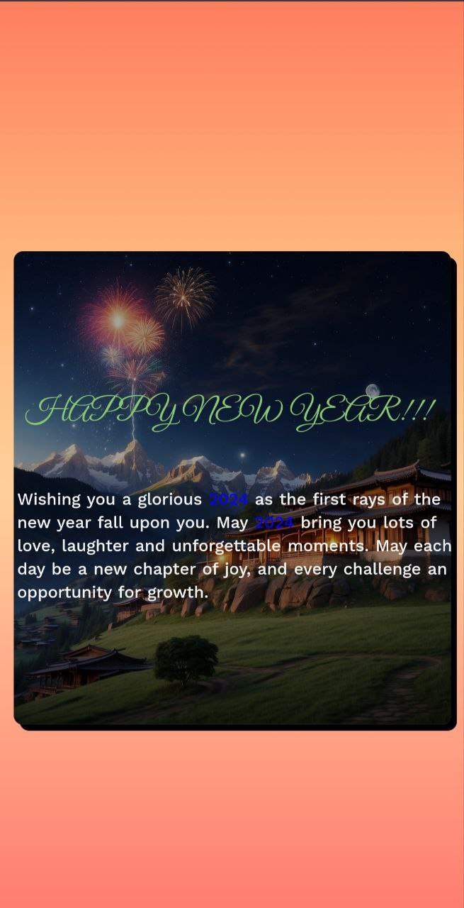

## OverView
This repository contains the webpage I have designed to wish my friends on new year(2024). It is a simple webpage designed only with HTML and CSS. I have used some animations to make it look more interactive.
***This webpage was designed for mobile phones only...***

## text color 
* teal: #38A3A5 or #46C0B7
* Gold: #D4AF37 or #FFD700
* cream: #F5F5F5 or #F0F0F0 

 ## screenshots
 

 ## Links
 click [here](https://tenze21.github.io/New-Year-Wishing-Card/) to visit the live site.

 ## Credits
 * The background image was generated with leonardo AI (check it out on: https://leonardo.ai/).
 * I have also used chatgpt (check it out on: https://chat.openai.com) to come up with some nice words.
 * I have also used bard to get the text color best suited for the background image since bard has the ability to recognise images.
 
